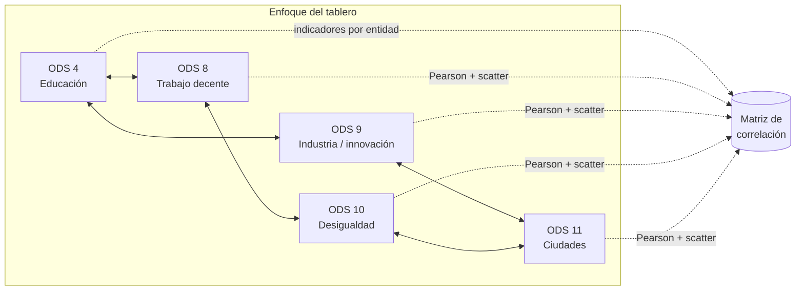

<div align="center">

# Pumitas Prime
### Correlaciones ODS 4, 8, 9, 10 y 11 · HackODS UNAM 2026

[](https://quarto.org/)
[](https://plotly.com/python/)
[](https://www.python.org/)
[](LICENSE)

</div>

## Datos del equipo (formato rúbrica)

| Campo | Valor |
| --- | --- |
| **Nombre del equipo** | Pumitas Prime |
| **Repositorio** | [MarxMad/HackODS-PumitasPrime](https://github.com/MarxMad/HackODS-PumitasPrime) |
| **ODS elegidos** | 4, 8, 9, 10, 11 |
| **Integrantes** | _Agregar nombres completos y rol breve_ |
| **Fecha de actualización** | 2026-04-10 |

## Línea del proyecto

**En una frase:** damos a las dependencias de gobierno una **foto estatal** de cómo se **combinan** educación, trabajo decente, innovación, desigualdad y ciudad, para **decidir dónde pilotar políticas integradas** y **qué secretarías conviene alinear** antes de invertir en evaluación de impacto.

## Pregunta que queremos resolver

**Pregunta guía (enfoque gubernamental):**  
_¿En qué entidades federativas los rezagos o avances en ODS 4, 8, 9, 10 y 11 **tienden a presentarse juntos**, de modo que tenga sentido diseñar **respuestas públicas coordinadas** (no solo programas aislados), y qué pares de dimensiones deberían ser prioridad en la agenda de gabinete y en la evidencia a generar?_

**Hipótesis de política pública (exploratoria, no causal):** los indicadores de estos cinco ODS **no se distribuyen al azar** entre estados: donde aparece un rezago fuerte en una dimensión, con frecuencia **coexisten** desviaciones en otras (por ejemplo educación + informalidad + pobreza relativa, o ciudad + desigualdad). Si ese patrón se confirma en los datos oficiales, **la política pública eficiente** no debería depender solo de metas sectoriales desarticuladas, sino de **paquetes territoriales** (educación + empleo + CTI + inclusión + vivienda/urbano) sujetos luego a **evaluación rigurosa**. El tablero sirve para **ubicar esos patrones** y **justificar ex ante** dónde conviene instrumentar pilotos integrados y estudios de seguimiento.

> Metodología: **correlación de Pearson** a nivel estatal. **No demuestra** que un programa cause un resultado; **sí ayuda** a priorizar territorios y combinaciones de agenda para diseño y evaluación de políticas.

## Diez preguntas de investigación (ODS 4–11 y correlación)

Lo que “resolvemos” aquí es **acotar y priorizar preguntas** que luego pueden llevarse a modelos, evaluaciones o políticas. El tablero permite ver si los datos **co-mueven** en el mismo sentido entre entidades.

1. **ODS 4 ↔ ODS 8:** ¿Mayor finalización escolar se asocia con menor empleo informal?
2. **ODS 4 ↔ ODS 9:** ¿Mejor desempeño educativo acompaña a mayor intensidad de investigación estatal?
3. **ODS 4 ↔ ODS 10:** ¿La educación se asocia con menor proporción bajo el 50% de la mediana de ingreso?
4. **ODS 4 ↔ ODS 11:** ¿El logro educativo se relaciona con menor vivienda precaria urbana?
5. **ODS 8 ↔ ODS 10:** ¿La informalidad laboral y la pobreza relativa por ingreso tienden a alinearse territorialmente?
6. **ODS 9 ↔ ODS 8:** ¿Innovación e informalidad muestran un patrón de complemento o de tensión entre estados?
7. **ODS 9 ↔ ODS 11:** ¿La capacidad de innovación se asocia con mejores condiciones urbanas?
8. **ODS 10 ↔ ODS 11:** ¿Desigualdad de ingreso y rezago urbano habitacional coevolucionan en el mapa estatal?
9. **ODS 8 ↔ ODS 11:** ¿El empleo informal se asocia con mayor vivienda precaria urbana?
10. **Síntesis:** ¿Qué enlaces son los más fuertes en la matriz de correlación y qué **agendas cruzadas** (educación, trabajo, CTI, inclusión, ciudad) conviene investigar o diseñar de forma integrada?

La versión contextualizada está en el tablero: `dashboard/index.qmd`.

## Público y para qué lo usarían

| Usuario | Para qué lo utiliza |
| --- | --- |
| **Equipos de política pública** (federal, estatal, municipal) | Comparar entidades, detectar **patrones territoriales** y formular **preguntas** para programas sectoriales (educación, empleo, ciencia, inclusión, vivienda-urbano). |
| **Investigación** (universidad, think tanks) | Plantear **hipótesis** y delimitar **variables** para trabajos cuantitativos posteriores; citar fuentes oficiales cuando el dataset pase de demo a producción. |
| **Sociedad civil y medios** | **Comunicar** de forma accesible cómo se relacionan dimensiones del desarrollo en el mapa estatal, sin simplificar en “una sola causa”. |
| **Estudiantes / hackathon** | Aprender a **conectar ODS con datos** y a documentar límites del análisis. |

**Audiencia principal:** tomadores de decisión y equipos técnicos que necesitan una **vista rápida, verificable y reproducible** del país en clave ODS 4–11.

**Audiencia secundaria:** académicos y analistas que reutilicen el repositorio como **punto de partida** (código + metadatos + narrativa).

## ODS en foco

- **ODS 4** Educación de calidad
- **ODS 8** Trabajo decente y crecimiento económico
- **ODS 9** Industria, innovación e infraestructura
- **ODS 10** Reducción de desigualdades
- **ODS 11** Ciudades y comunidades sostenibles

### Mapa visual de los ODS (identidad y lectura)

<table>
<tr>
<td width="20%" align="center">
<a href="https://www.un.org/sustainabledevelopment/es/education/">

</a>
<br/><sub>Finalización escolar, equidad, infraestructura educativa</sub>
</td>
<td width="20%" align="center">
<a href="https://www.un.org/sustainabledevelopment/es/economic-growth/">

</a>
<br/><sub>Empleo, productividad, informalidad, inclusión financiera</sub>
</td>
<td width="20%" align="center">
<a href="https://www.un.org/sustainabledevelopment/es/infrastructure/">

</a>
<br/><sub>Manufactura, I+D, infraestructura, tecnología</sub>
</td>
<td width="20%" align="center">
<a href="https://www.un.org/sustainabledevelopment/es/inequality/">

</a>
<br/><sub>Ingresos, pobreza relativa, política fiscal y Gini</sub>
</td>
<td width="20%" align="center">
<a href="https://www.un.org/sustainabledevelopment/es/cities/">

</a>
<br/><sub>Vivienda, movilidad, residuos, aire, espacio público</sub>
</td>
</tr>
</table>

### Indicadores del prototipo (columnas del CSV)

| Variable en `data/indicadores_ods_demo.csv` | Lectura en el tablero |
| --- | --- |
| `ods_4_finalizacion_prim_sec_prep` | **ODS 4** · Índice de finalización (enseñanza primaria, secundaria y preparatoria), proxy de trayectoria escolar. |
| `ods_8_empleo_informal` | **ODS 8** · Empleo informal en el empleo no agropecuario (%). |
| `ods_9_investigadores_millón` | **ODS 9** · Personas investigadoras por millón de habitantes. |
| `ods_10_pobreza_50_mediana` | **ODS 10** · Población bajo el 50% de la mediana de ingreso (%). |
| `ods_11_vivienda_precaria` | **ODS 11** · Vivienda precaria en ámbito urbano (%). |

En la entrega final cada fila se sustituirá por series oficiales homologadas; ver `data/metadata_datasets.md`.

### Esquema del análisis (Mermaid)



> Cada nodo es un **eje ODS** en el tablero. Las líneas punteadas indican que los **cinco indicadores** alimentan la misma **matriz de correlación** y las visualizaciones asociadas. **Correlación no implica causalidad.**

## Visualizaciones del prototipo

- **Matriz de correlación (Pearson)** entre cinco indicadores.
- **Dispersión** ODS 4 vs ODS 8 con tendencia lineal.
- **Barras horizontales** de correlación contra variable base (ODS 4).

Tablero: `dashboard/index.qmd`  
Render: `dashboard/index.html`

## Selección y calidad de datos

### Fuentes

- Portal oficial de indicadores ODS Mexico: [agenda2030.mx](https://agenda2030.mx)
- Mapeo de metas e indicadores usados por el equipo: `Correlacionobjetivos.md`
- Guía técnica API REST: `Guia_ODS/05_guia_servicio_RESTful.pdf`

### Justificación de selección

Se eligieron indicadores que capturan cinco dimensiones complementarias:
- capital humano (educación),
- inserción económica (informalidad),
- capacidades productivas/tecnológicas (investigación),
- distribución del ingreso (pobreza relativa),
- entorno urbano (vivienda precaria).

Esta combinación permite evaluar coherencia territorial entre desarrollo social, dinamismo económico e inclusión urbana.

### Metadatos (obligatorio rúbrica)

Ver archivo dedicado: `data/metadata_datasets.md`  
Incluye fuente, fecha de descarga, licencia y diccionario de variables.

## Cumplimiento técnico (Módulo A)

- **A1 Licencia CC BY-SA:** `LICENSE`
- **A2 README completo:** este archivo
- **A3 Metadatos de datos:** `data/metadata_datasets.md`
- **A4 Estructura de carpetas:** `data/`, `scripts/`, `dashboard/`
- **A5 Declaratoria de IA:** `ai-log.md`

## Estructura del repositorio

```text
ODS_Pumitas/
├── docs/
│   └── README.md
├── dashboard/
│   ├── index.qmd
│   ├── index.html
│   └── index_files/
├── data/
│   ├── indicadores_ods_demo.csv
│   └── metadata_datasets.md
├── scripts/
│   ├── README.md
│   └── fetch_api_template.py
├── Guia_ODS/
├── notebooks/
│   └── README.md
├── Correlacionobjetivos.md
├── ai-log.md
├── _quarto.yml
├── .python-version
├── pyproject.toml
├── main.py
├── requirements.txt
├── LICENSE
└── README.md
```

## Reproducibilidad

```bash
git clone https://github.com/MarxMad/HackODS-PumitasPrime.git
cd HackODS-PumitasPrime
python3 -m venv .venv
source .venv/bin/activate
python -m pip install -r requirements.txt
export QUARTO_PYTHON="$(pwd)/.venv/bin/python3"
quarto render
```

### Si ves `externally-managed-environment` (macOS / Homebrew)

Ese mensaje aparece cuando `pip` intenta instalar en el Python del sistema (PEP 668), no en el venv. Con el entorno activado, instala siempre con el intérprete del venv:

```bash
source .venv/bin/activate
which python
python -m pip install -r requirements.txt
```

Deberías ver rutas bajo `.venv/`. Luego `quarto render` como arriba.

### Uso de pandas y jupyter en este proyecto

- `pandas` se usa en `dashboard/index.qmd` para cargar y preparar `data/indicadores_ods_demo.csv`.
- `jupyter` se usa como motor de ejecucion de celdas Python al renderizar Quarto.

Comandos utiles:

```bash
# verificar que pandas y jupyter quedaron instalados
python -c "import pandas, jupyter; print('OK pandas+jupyter')"

# abrir entorno jupyter para exploracion adicional (opcional)
jupyter notebook
```

Atajo opcional para validar estructura:

```bash
python main.py
```

## Nota de seguridad

Los scripts SQL de guía usan marcadores `REEMPLAZAR_*` para evitar publicar contraseñas reales. Si se ejecutan en entorno local, cada equipo debe configurar credenciales propias fuera de Git.
