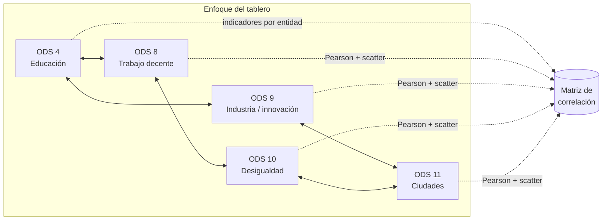

<div align="center">

# Pumitas Prime

### Correlaciones entre Objetivos de Desarrollo Sostenible · HACKODS UNAM

Exploramos **cómo se relacionan** indicadores de la Agenda 2030 **a nivel estatal** (México), con un tablero interactivo construido en **Quarto** y **Plotly**.

[](https://quarto.org/)
[](https://www.python.org/)
[](https://plotly.com/python/)

[](https://github.com/MarxMad/HackODS-PumitasPrime)

<br/>

| <sub>ODS en foco</sub> |
| :---: |
| **4 · 8 · 9 · 10 · 11** |

</div>

---

## Alcance del proyecto

Este repositorio concentra el **tablero de correlaciones** y el material de apoyo (guías SQL, notas de indicadores). Nos basamos en **cinco ODS** que enlazan educación, economía, industria, equidad y territorio urbano.

<table>
<tr>
<td width="20%" align="center">
<a href="https://www.un.org/sustainabledevelopment/es/education/">

</a>
<br/><sub>Finalización escolar, equidad, infraestructura educativa</sub>
</td>
<td width="20%" align="center">
<a href="https://www.un.org/sustainabledevelopment/es/economic-growth/">

</a>
<br/><sub>Empleo, productividad, informalidad, inclusion financiera</sub>
</td>
<td width="20%" align="center">
<a href="https://www.un.org/sustainabledevelopment/es/infrastructure/">

</a>
<br/><sub>Manufactura, I+D, infraestructura, tecnología</sub>
</td>
<td width="20%" align="center">
<a href="https://www.un.org/sustainabledevelopment/es/inequality/">

</a>
<br/><sub>Ingresos, pobreza relativa, política fiscal y Gini</sub>
</td>
<td width="20%" align="center">
<a href="https://www.un.org/sustainabledevelopment/es/cities/">

</a>
<br/><sub>Vivienda, movilidad, residuos, aire, espacio público</sub>
</td>
</tr>
</table>



> Cada nodo representa un **eje de la Agenda 2030** en el que anclamos indicadores. El tablero **no afirma causalidad**: muestra **asociaciones** entre variables estatales para narrar prioridades y preguntas de política pública.

---

## Vista rápida del tablero

| Elemento | Qué verás |
| -------- | --------- |
| **Mapa de calor** | Correlaciones de Pearson entre indicadores seleccionados |
| **Dispersión** | Relación bivariada (ej. educación vs empleo informal) con tendencia |
| **Barras** | Correlación de cada indicador respecto a una variable base |

Abre el informe renderizado: [`dashboard/index.html`](dashboard/index.html) (tras clonar) o navega al archivo en [el repositorio](https://github.com/MarxMad/HackODS-PumitasPrime/tree/main/dashboard).

---

## Estructura del repo

```
ODS_Pumitas/
├── dashboard/
│   ├── index.qmd          ← Tablero principal (convención HACKODS)
│   ├── index.html         ← Salida HTML (tras quarto render)
│   └── index_files/       ← Librerías estáticas Quarto
├── data/
│   └── indicadores_ods_demo.csv   ← Datos de ejemplo (sustituir por agenda2030 / INEGI)
├── Guia_ODS/              ← Scripts SQL y PDFs de la guía de base de datos ODS
├── Correlacionobjetivos.md    ← Metas e indicadores de referencia (ODS 4, 8, 9, 10, 11)
├── _quarto.yml
├── requirements.txt
└── README.md
```

### Guía SQL (`Guia_ODS/`)

Los scripts que crean logins (`2._Script_Crear_Login_y_Usuario.sql`) y usuarios de prueba usan literales **`REEMPLAZAR_*`**. Sustitúyelos por contraseñas fuertes **solo en tu máquina o servidor**; no subas valores reales al repositorio.

---

## Cómo ejecutar localmente

```bash
git clone https://github.com/MarxMad/HackODS-PumitasPrime.git
cd HackODS-PumitasPrime

python3 -m venv .venv
source .venv/bin/activate          # Windows: .venv\Scripts\activate
pip install -r requirements.txt

export QUARTO_PYTHON="$(pwd)/.venv/bin/python3"   # Ajusta la ruta si usas Windows
quarto render
```

El HTML se genera en **`dashboard/index.html`**.

---

## Fuentes de datos

- Indicadores oficiales México: [Agenda 2030 — indicadores](https://agenda2030.mx)
- Lista detallada de metas y enlaces por indicador: ver [`Correlacionobjetivos.md`](Correlacionobjetivos.md)

---

## Equipo

**Pumitas Prime** · HACKODS UNAM

---

<div align="center">

<sub>Paleta de badges alineada con los colores institucionales de los ODS de la ONU · 2026</sub>

</div>
