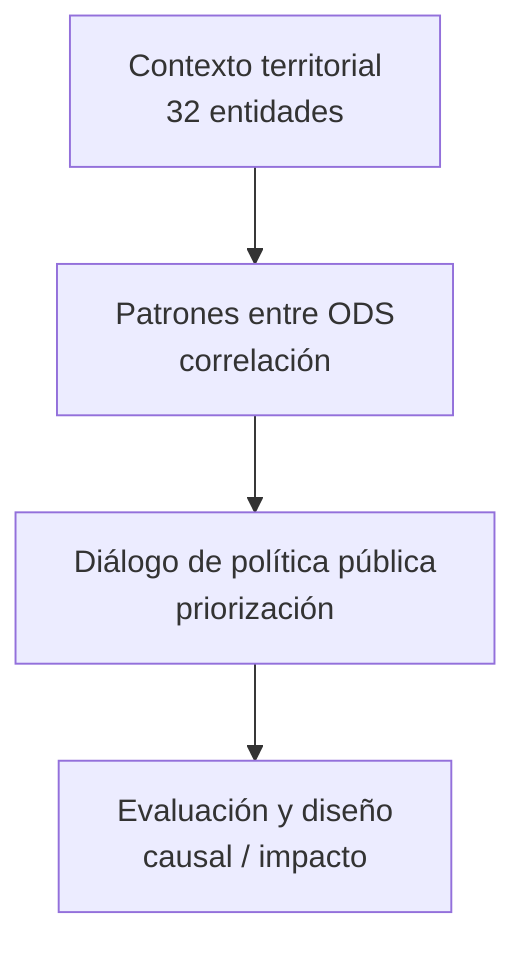
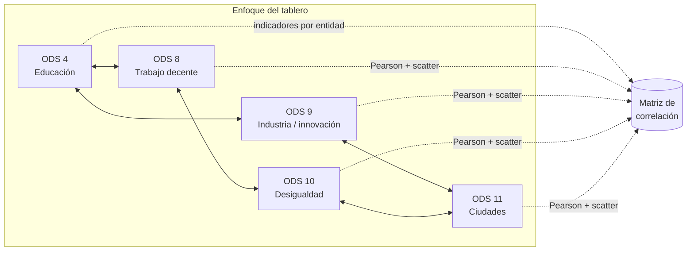

<div align="center">

# Pumitas Prime
### Correlaciones ODS 4, 8, 9, 10 y 11 · HackODS UNAM 2026

[](https://quarto.org/)
[](https://plotly.com/python/)
[](https://www.python.org/)
[](LICENSE)

**[Tablero (QMD)](dashboard/index.qmd)** · **[Salida HTML](dashboard/index.html)** · **[Metadatos](data/metadata_datasets.md)** · **[Uso de IA](ai-log.md)**

</div>

---

## Historia del proyecto (storytelling)

### Escena 1 — México en clave ODS, pero visto por piezas

La Agenda 2030 llega a las mesas de trabajo como **metas y programas**: educación acá, empleo allá, ciencia más allá, inclusión y ciudad en otro costado. Tiene sentido operativo; el riesgo es **tratar el territorio como carpetas por secretaría** cuando los problemas **llegan en manojo**: la misma entidad puede arrastrar rezagos que se tocan entre sí.

### Escena 2 — La tensión que queremos visibilizar

Imagina un gabinete estatal o federal que pregunta: *“¿Dónde conviene que dejemos de tratar síntomas sueltos y empecemos a coordinar?”* No siempre hay tiempo para un paper antes de la sesión. Hace falta una **brújula rápida**: algo que diga *“mira, en estos estados estas dimensiones suelen ir juntas; vale la pena hablar en conjunto de educación, empleo, CTI, inclusión y ciudad”*.

### Escena 3 — Qué hace **Pumitas Prime**

Somos un **tablero vivo** (Quarto + Plotly) que cruza **cinco ODS** con datos **por entidad**: educación (4), trabajo decente (8), innovación (9), desigualdad (10) y ciudades (11). No “resuelve” el país en una pantalla: **encuadra la conversación** con gráficas que cualquier persona técnica puede leer en minutos.

### Desenlace — Promesa honesta

Usamos **correlación de Pearson** como lenguaje común entre secretarías. Eso **no demuestra** que un programa cause un resultado; **sí ordena** el mapa para decidir **dónde pilotar paquetes integrados** y **qué evidencia generar después** (evaluación de impacto, modelos, trabajo de campo).



Las **líneas de investigación** (preguntas concretas entre pares de ODS) están desarrolladas **en el tablero** [`dashboard/index.qmd`](dashboard/index.qmd): este README prioriza la **historia y la lectura visual** para jueces y visitantes.

<details>
<summary><strong>Ficha del equipo (HackODS · clic para expandir)</strong></summary>

| Campo | Valor |
| --- | --- |
| **Nombre del equipo** | Pumitas Prime |
| **Repositorio** | [MarxMad/HackODS-PumitasPrime](https://github.com/MarxMad/HackODS-PumitasPrime) |
| **ODS elegidos** | 4, 8, 9, 10, 11 |
| **Integrantes** | _Agregar nombres completos y rol breve_ |
| **Fecha de actualización** | 2026-04-10 |

</details>

---

## En una sola mirada

| | |
| ---: | :--- |
| **Línea** | Foto estatal de cómo se **combinan** educación, trabajo decente, innovación, desigualdad y ciudad. |
| **Pregunta guía** | ¿Dónde los avances o rezagos en ODS 4–11 **tienden a presentarse juntos** y por tanto conviene **coordinar** políticas y pilotos? |
| **Hipótesis (exploratoria)** | Los rezagos **no aparecen al azar** entre estados: suelen **agruparse**; eso invita a **paquetes territoriales** sujetos a evaluación rigurosa. |

---

## ¿Para quién es este repositorio?

| Perfil | Qué obtiene al abrirlo |
| --- | --- |
| **Gobierno** (planeación, gabinete, técnico) | Una **vista comparativa** entre entidades y un lenguaje común para **alinear** agendas antes de invertir en evaluación. |
| **Investigación** | Un **punto de partida reproducible**: variables, código y metadatos para pasar de exploración a modelos serios. |
| **Sociedad civil y medios** | Una **narrativa basada en datos** sin vender causalidad falsa. |
| **Estudiantes / hackathon** | Un ejemplo de cómo **aterrizar ODS** en tablero y documentación. |

## ODS en foco (los cinco ejes)

| ODS | Nombre | Rol en la historia del tablero |
| --- | --- | --- |
| **4** | Educación de calidad | Trayectoria escolar y capital humano |
| **8** | Trabajo decente | Inserción laboral e informalidad |
| **9** | Industria e innovación | Capacidades científicas y tecnológicas |
| **10** | Reducción de desigualdades | Distribución del ingreso |
| **11** | Ciudades sostenibles | Condición urbana y vivienda |

### Mapa visual de los ODS (identidad y lectura)

<table>
<tr>
<td width="20%" align="center">
<a href="https://www.un.org/sustainabledevelopment/es/education/">

</a>
<br/><sub>Finalización escolar, equidad, infraestructura educativa</sub>
</td>
<td width="20%" align="center">
<a href="https://www.un.org/sustainabledevelopment/es/economic-growth/">

</a>
<br/><sub>Empleo, productividad, informalidad, inclusión financiera</sub>
</td>
<td width="20%" align="center">
<a href="https://www.un.org/sustainabledevelopment/es/infrastructure/">

</a>
<br/><sub>Manufactura, I+D, infraestructura, tecnología</sub>
</td>
<td width="20%" align="center">
<a href="https://www.un.org/sustainabledevelopment/es/inequality/">

</a>
<br/><sub>Ingresos, pobreza relativa, política fiscal y Gini</sub>
</td>
<td width="20%" align="center">
<a href="https://www.un.org/sustainabledevelopment/es/cities/">

</a>
<br/><sub>Vivienda, movilidad, residuos, aire, espacio público</sub>
</td>
</tr>
</table>

### Indicadores del prototipo (columnas del CSV)

| Variable en `data/indicadores_ods_demo.csv` | Lectura en el tablero |
| --- | --- |
| `ods_4_finalizacion_prim_sec_prep` | **ODS 4** · Índice de finalización (enseñanza primaria, secundaria y preparatoria), proxy de trayectoria escolar. |
| `ods_8_empleo_informal` | **ODS 8** · Empleo informal en el empleo no agropecuario (%). |
| `ods_9_investigadores_millón` | **ODS 9** · Personas investigadoras por millón de habitantes. |
| `ods_10_pobreza_50_mediana` | **ODS 10** · Población bajo el 50% de la mediana de ingreso (%). |
| `ods_11_vivienda_precaria` | **ODS 11** · Vivienda precaria en ámbito urbano (%). |

En la entrega final cada fila se sustituirá por series oficiales homologadas; ver `data/metadata_datasets.md`.

### Esquema del análisis (Mermaid)



> Cada nodo es un **eje ODS** en el tablero. Las líneas punteadas indican que los **cinco indicadores** alimentan la misma **matriz de correlación** y las visualizaciones asociadas. **Correlación no implica causalidad.**

## Cómo se ve el tablero (tres capas visuales)

| Capa | Qué ves | Para qué sirve en la narrativa |
| --- | --- | --- |
| **1 · Matriz** | Calor de correlaciones (Pearson) entre los cinco indicadores | Detectar de un vistazo **qué pares** dialogan más fuerte entre estados |
| **2 · Dispersión** | ODS 4 frente a ODS 8 con tendencia lineal | Bajar del mapa completo a **una historia bivariada** (educación y empleo) |
| **3 · Barras** | Correlación de cada indicador respecto a ODS 4 como base | Responder: *“si priorizamos educación, ¿qué otros ODS se mueven en la misma dirección?”* |

**Archivos:** [`dashboard/index.qmd`](dashboard/index.qmd) (fuente) · [`dashboard/index.html`](dashboard/index.html) (resultado de `quarto render`)

## Selección y calidad de datos

### Fuentes

- Portal oficial de indicadores ODS México: [agenda2030.mx](https://agenda2030.mx)
- Mapeo de metas e indicadores usados por el equipo: `Correlacionobjetivos.md`
- Guía técnica API REST: `Guia_ODS/05_guia_servicio_RESTful.pdf`

### Justificación de selección

Se eligieron indicadores que capturan cinco dimensiones complementarias:
- capital humano (educación),
- inserción económica (informalidad),
- capacidades productivas/tecnológicas (investigación),
- distribución del ingreso (pobreza relativa),
- entorno urbano (vivienda precaria).

Esta combinación permite evaluar coherencia territorial entre desarrollo social, dinamismo económico e inclusión urbana.

### Metadatos (obligatorio rúbrica)

Ver archivo dedicado: `data/metadata_datasets.md`  
Incluye fuente, fecha de descarga, licencia y diccionario de variables.

<details>
<summary><strong>Checklist Módulo A (rúbrica HackODS)</strong></summary>

| Criterio | Evidencia en el repo |
| --- | --- |
| **A1** Licencia CC BY-SA | [`LICENSE`](LICENSE) |
| **A2** README completo | Este archivo |
| **A3** Metadatos de datos | [`data/metadata_datasets.md`](data/metadata_datasets.md) |
| **A4** Carpetas `data/`, `scripts/`, `dashboard/` | Estructura en árbol más abajo |
| **A5** Declaratoria de IA | [`ai-log.md`](ai-log.md) |

</details>

## Estructura del repositorio

```text
ODS_Pumitas/
├── docs/
│   └── README.md
├── dashboard/
│   ├── index.qmd
│   ├── index.html
│   └── index_files/
├── data/
│   ├── indicadores_ods_demo.csv
│   └── metadata_datasets.md
├── scripts/
│   ├── README.md
│   └── fetch_api_template.py
├── Guia_ODS/
├── notebooks/
│   └── README.md
├── Correlacionobjetivos.md
├── ai-log.md
├── _quarto.yml
├── .python-version
├── pyproject.toml
├── main.py
├── requirements.txt
├── LICENSE
└── README.md
```

## Reproducibilidad

```bash
git clone https://github.com/MarxMad/HackODS-PumitasPrime.git
cd HackODS-PumitasPrime
python3 -m venv .venv
source .venv/bin/activate
python -m pip install -r requirements.txt
export QUARTO_PYTHON="$(pwd)/.venv/bin/python3"
quarto render
```

### Si ves `externally-managed-environment` (macOS / Homebrew)

Ese mensaje aparece cuando `pip` intenta instalar en el Python del sistema (PEP 668), no en el venv. Con el entorno activado, instala siempre con el intérprete del venv:

```bash
source .venv/bin/activate
which python
python -m pip install -r requirements.txt
```

Deberías ver rutas bajo `.venv/`. Luego `quarto render` como arriba.

### Uso de pandas y jupyter en este proyecto

- `pandas` se usa en `dashboard/index.qmd` para cargar y preparar `data/indicadores_ods_demo.csv`.
- `jupyter` se usa como motor de ejecucion de celdas Python al renderizar Quarto.

Comandos utiles:

```bash
# verificar que pandas y jupyter quedaron instalados
python -c "import pandas, jupyter; print('OK pandas+jupyter')"

# abrir entorno jupyter para exploracion adicional (opcional)
jupyter notebook
```

Atajo opcional para validar estructura:

```bash
python main.py
```

## Nota de seguridad

Los scripts SQL de guía usan marcadores `REEMPLAZAR_*` para evitar publicar contraseñas reales. Si se ejecutan en entorno local, cada equipo debe configurar credenciales propias fuera de Git.
