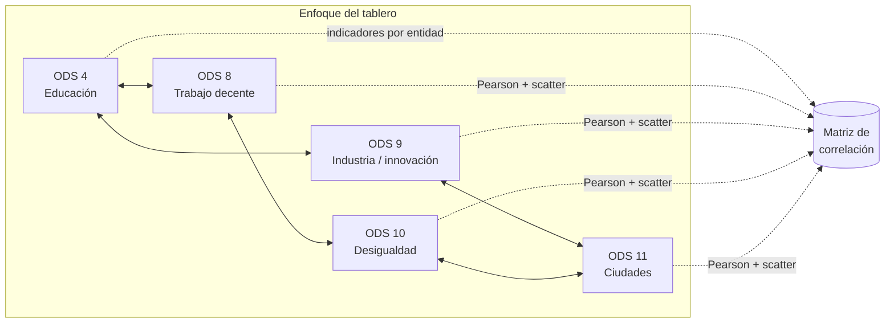

## Línea del proyecto

Este tablero apoya una **pregunta de política pública**: *¿en qué estados los indicadores de educación (ODS 4), trabajo decente (ODS 8), innovación (ODS 9), desigualdad (ODS 10) y ciudad (ODS 11) **suelen ir de la mano***, de forma que convenga plantear **respuestas coordinadas entre dependencias** y **pilotos territoriales** en lugar de solo escalar un programa aislado? La evidencia aquí es **asociativa** (correlación): sirve para **priorizar** y **dialogar en gabinete**; la **causalidad** se aborda con evaluaciones y diseños empíricos posteriores.

**¿Quién lo usa y para qué?** Titulares y equipos técnicos de política social, economía, educación, ciencia y desarrollo urbano (diagnóstico y priorización); investigación aplicada (delimitar preguntas evaluables); y divulgación. Referencia de metas: [Correlacionobjetivos](../Correlacionobjetivos.md).

::: callout-note
Los valores del archivo `data/indicadores_ods_demo.csv` son **ilustrativos** (montados para el hackathon). Para el entregable final, sustitúyelos por series oficiales desde [agenda2030.mx](https://agenda2030.mx) / INEGI, con el mismo formato de columnas.
:::

## ODS e indicadores (lectura visual)

<table>
<tr>
<td width="20%" align="center">
<a href="https://www.un.org/sustainabledevelopment/es/education/">

</a>
<br/><sub>Finalización escolar, equidad, infraestructura educativa</sub>
</td>
<td width="20%" align="center">
<a href="https://www.un.org/sustainabledevelopment/es/economic-growth/">

</a>
<br/><sub>Empleo, productividad, informalidad</sub>
</td>
<td width="20%" align="center">
<a href="https://www.un.org/sustainabledevelopment/es/infrastructure/">

</a>
<br/><sub>I+D, manufactura, tecnología</sub>
</td>
<td width="20%" align="center">
<a href="https://www.un.org/sustainabledevelopment/es/inequality/">

</a>
<br/><sub>Ingreso, pobreza relativa</sub>
</td>
<td width="20%" align="center">
<a href="https://www.un.org/sustainabledevelopment/es/cities/">

</a>
<br/><sub>Vivienda y entorno urbano</sub>
</td>
</tr>
</table>

| Columna en el CSV | Qué mide (proxy en el prototipo) |
| --- | --- |
| `ods_4_finalizacion_prim_sec_prep` | Finalización escolar (índice). |
| `ods_8_empleo_informal` | Empleo informal no agropecuario (%). |
| `ods_9_investigadores_millón` | Investigadores por millón de habitantes. |
| `ods_10_pobreza_50_mediana` | Población bajo el 50% de la mediana de ingreso (%). |
| `ods_11_vivienda_precaria` | Vivienda precaria urbana (%). |



> **Nota:** la correlación describe **co-movimiento** entre estados; no atribuye efectos a políticas concretas.

## Diez preguntas de investigación (correlación entre ODS 4, 8, 9, 10 y 11)

Estas preguntas **orientan** el análisis del tablero: cada una puede contrastarse con la **matriz de correlación** y las **gráficas** (siempre como asociación, no como prueba causal).

1. **ODS 4 ↔ ODS 8:** ¿Las entidades con mayor finalización escolar tienden a exhibir menor proporción de empleo informal, o el patrón es heterogéneo?
2. **ODS 4 ↔ ODS 9:** ¿El logro educativo coexiste con mayor intensidad de investigación (investigadores por millón de habitantes) a nivel estatal?
3. **ODS 4 ↔ ODS 10:** ¿Un mejor desempeño educativo se asocia con menor proporción de población bajo el 50% de la mediana de ingreso?
4. **ODS 4 ↔ ODS 11:** ¿La educación se vincula con menor rezago de vivienda precaria en zonas urbanas, o aparecen desacoples territoriales?
5. **ODS 8 ↔ ODS 10:** ¿La informalidad laboral se asocia con mayor pobreza relativa (ingreso), sugiriendo un frente común de política social y laboral?
6. **ODS 9 ↔ ODS 8:** ¿Mayor capacidad de innovación acompaña a menor informalidad (complementariedad productiva) o no hay relación lineal clara?
7. **ODS 9 ↔ ODS 11:** ¿La innovación medida por ciencia y tecnología se relaciona con mejores condiciones urbanas, o priman otros factores?
8. **ODS 10 ↔ ODS 11:** ¿La desigualdad de ingreso y el rezago habitacional urbano avanzan en paralelo entre estados?
9. **ODS 8 ↔ ODS 11:** ¿El empleo informal se asocia con mayor proporción de vivienda precaria, abriendo preguntas sobre trabajo decente y territorio?
10. **Síntesis (red de cinco ODS):** ¿Qué pares de indicadores muestran las asociaciones más fuertes en el mapa estatal y qué **paquetes de política** (educación + empleo + CTI + inclusión + ciudad) merecerían diseñarse de forma coordinada para investigación y evaluación posterior?

```{python}
#| label: setup
import os
import pandas as pd
import numpy as np
import plotly.graph_objects as go
from pathlib import Path

# Raíz del proyecto Quarto (válida aunque el .qmd esté en dashboard/)
root = Path(os.environ.get("QUARTO_PROJECT_DIR", Path.cwd()))
data_path = root / "data" / "indicadores_ods_demo.csv"
df = pd.read_csv(data_path)

etiquetas = {
    "ods_4_finalizacion_prim_sec_prep": "ODS 4 · Finalización escolar (índice)",
    "ods_8_empleo_informal": "ODS 8 · Empleo informal (%)",
    "ods_9_investigadores_millón": "ODS 9 · Investigadores / millón hab.",
    "ods_10_pobreza_50_mediana": "ODS 10 · Bajo 50% mediana ingreso (%)",
    "ods_11_vivienda_precaria": "ODS 11 · Vivienda precaria urbana (%)",
}

cols_num = list(etiquetas.keys())
df_corr = df[cols_num].copy()
```

## Vista rápida de los datos

```{python}
#| label: tbl-preview
df.rename(columns=etiquetas).head(8)
```

## Matriz de correlación (Pearson)

Los coeficientes van de -1 a 1. Valores absolutos altos sugieren que dos indicadores **suben o bajan juntos** en las entidades; un signo negativo indica relación inversa. La correlación **no implica** causalidad.

```{python}
#| label: fig-heatmap
#| fig-cap: "Correlaciones de Pearson entre cinco indicadores (32 entidades, datos demo)."

R = df_corr.corr(method="pearson")
labels = [etiquetas[c] for c in R.columns]

fig = go.Figure(
    data=go.Heatmap(
        z=R.values,
        x=labels,
        y=labels,
        zmin=-1,
        zmax=1,
        colorscale="RdBu",
        zmid=0,
        text=np.round(R.values, 2),
        texttemplate="%{text}",
        colorbar=dict(title="r"),
    )
)
fig.update_layout(
    title="Matriz de correlación",
    xaxis_tickangle=-35,
    height=520,
    margin=dict(l=280, r=40, t=60, b=120),
)
fig.show()
```

## Dispersión: educación vs trabajo informal

Un ejemplo de narrativa para el jurado: a mayor **finalización escolar**, suele observarse menor **empleo informal** (en datos reales conviene validar por año y controles).

```{python}
#| label: fig-scatter
#| fig-cap: "Cada punto es una entidad federativa (datos demo). Recta: ajuste lineal mínimos cuadrados (numpy)."

x = df["ods_4_finalizacion_prim_sec_prep"].to_numpy()
y = df["ods_8_empleo_informal"].to_numpy()
m, b = np.polyfit(x, y, 1)
x_line = np.linspace(x.min(), x.max(), 50)
y_line = m * x_line + b

fig = go.Figure()
fig.add_trace(
    go.Scatter(
        x=x,
        y=y,
        mode="markers",
        marker=dict(size=10, opacity=0.85),
        text=df["entidad"],
        hovertemplate="%{text}<br>x=%{x:.3f}<br>y=%{y:.1f}<extra></extra>",
        name="Entidades",
    )
)
fig.add_trace(
    go.Scatter(
        x=x_line,
        y=y_line,
        mode="lines",
        name="Tendencia lineal",
        line=dict(color="firebrick", width=2),
    )
)
fig.update_layout(
    title="ODS 4 vs ODS 8",
    xaxis_title=etiquetas["ods_4_finalizacion_prim_sec_prep"],
    yaxis_title=etiquetas["ods_8_empleo_informal"],
    height=480,
    legend=dict(yanchor="top", y=0.99, xanchor="left", x=0.01),
)
fig.show()
```


## Barras: correlación de cada indicador con “finalización escolar”

```{python}
#| label: fig-bars
base = "ods_4_finalizacion_prim_sec_prep"
others = [c for c in cols_num if c != base]
r_series = pd.Series({etiquetas[o]: R.loc[base, o] for o in others})

fig = go.Figure(
    data=go.Bar(
        x=r_series.values,
        y=r_series.index,
        orientation="h",
        marker_color=np.where(r_series.values >= 0, "#2E86AB", "#C73E1D"),
    )
)
fig.update_layout(
    title=f"Correlación con: {etiquetas[base]}",
    xaxis_title="Correlación de Pearson (r)",
    yaxis=dict(autorange="reversed"),
    height=360,
    margin=dict(l=280),
)
fig.add_vline(x=0, line_width=1, line_dash="dash", line_color="gray")
fig.show()
```

## Cómo conectar con tus fuentes reales

1. Descarga series por entidad desde los enlaces de `Correlacionobjetivos.md` (por ejemplo 4.1.2, 8.3.1, 9.5.2, 10.2.1, 11.1.1).
2. Unifica **mismo año** (o promedio móvil) y **misma cobertura** geográfica.
3. Reemplaza `data/indicadores_ods_demo.csv` manteniendo columnas numéricas + `entidad`; vuelve a renderizar con `quarto render dashboard/index.qmd` (o `quarto render` desde la raíz del proyecto).

La carpeta `Guia_ODS` con scripts SQL sirve si tu equipo centraliza indicadores en una base propia; el flujo de Quarto solo necesita el CSV (o lectura SQL vía `pandas.read_sql` si más adelante conectas la BD).
